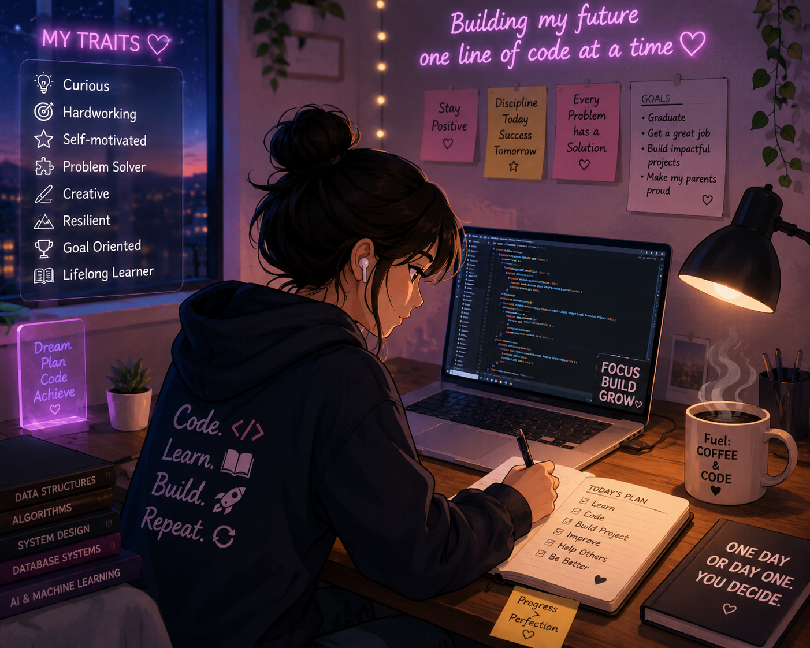

# Hi there! 👋 I'm Sheema

### 💻 Computer Science & Engineering (AI & ML) Undergraduate

### Software Development • Web Development • AI • Data Analytics

  

  
  

---

# 🚀 About Me

I'm a **Computer Science & Engineering (AI & ML)** undergraduate passionate about learning, building, and exploring technology.

My interests span **Software Development, Web Development, Artificial Intelligence, Machine Learning, Data Analytics, and Database Management**.

- 🌱 Currently learning **Java, SQL, Data Structures & Algorithms, Full Stack Development & Machine Learning**
- 💻 Interested in **Software Development & Web Development**
- 🤖 Exploring **Artificial Intelligence, Machine Learning & Data Analytics**
- 🚀 Open to internships, collaborations, and open-source contributions
- 🎯 Goal: Build innovative software solutions while continuously improving my technical and problem-solving skills

---

# 🛠️ Tech Stack

### 👨‍💻 Programming Languages

### 🌐 Web Development

### 📚 Libraries & Frameworks

### 🗄️ Database

### 🛠️ Tools

---

# 📚 Core Concepts

- 💡 Object-Oriented Programming
- 🧩 Data Structures & Algorithms
- 🗄️ Database Management Systems
- 💾 SQL
- 🖥️ Operating Systems
- 🌐 Computer Networks
- ⚙️ Software Engineering
- 🤖 Artificial Intelligence
- 📈 Machine Learning
- 🌍 Web Development

---

# 🚀 Featured Projects

## 🎯 Interview Questions Predictor Using Machine Learning

An AI-powered web application that predicts interview questions based on users' skills and selected job roles.

### Features

- 🤖 Machine Learning recommendation system
- 💡 AI-assisted interview question generation
- 🌐 Interactive web interface
- 📊 Personalized interview preparation

**Tech Stack:** Python • Flask • Scikit-learn • HTML • CSS

---

## 💳 Credit Card Fraud Detection

Developed a Machine Learning model to identify fraudulent credit card transactions.

### Features

- 📊 Data preprocessing
- 📈 Feature engineering
- 🤖 Logistic Regression
- ✅ Fraud prediction

**Tech Stack:** Python • Pandas • NumPy • Scikit-learn

---

## 🏥 Hospital Management System

Responsive web application for managing hospital information and appointments.

### Features

- 🖥️ Responsive design
- 📅 Appointment management
- 👨‍⚕️ User-friendly interface

**Tech Stack:** HTML • CSS • JavaScript

---

# 🔥 Streak Stats

---

# 📈 Contribution Graph

---

# 📫 Connect With Me

---

## 💡 Quote

### *"Always learning. Always building. Always evolving."*

⭐ **Thanks for visiting my profile!**

